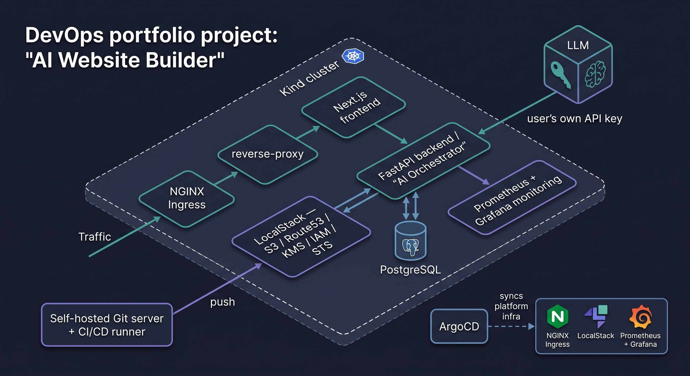

# AI Website Builder

A hands-on DevOps learning project built around a real product: friends log in, chat with an AI (their own LLM API key) to iteratively edit a website, preview it live, and push it — CI syncs the static site to S3 and it goes live on their own domain.

The product is the vehicle. The goal is practicing DevOps end-to-end — auth, secrets management, Kubernetes, IaC, GitOps, and observability — around one coherent, real user flow, instead of isolated tutorial exercises.

Full architecture, design decisions, and the phase-by-phase build plan live in [`overview.md`](./overview.md).



## Status

- [x] **Phase 1 — Local environment**: Kind cluster, ingress-nginx, LocalStack (S3/Route53/KMS/IAM/STS), least-privilege IAM via Terraform
- [x] **Phase 2 — Backend & database**: PostgreSQL schema, FastAPI, Gitea (per-project repos), KMS envelope-encrypted API keys, AI chat/push — full loop (register → project → encrypted key → chat → push a real commit) verified end-to-end
- [x] **Phase 3 — Frontend**: Next.js auth, live preview canvas — full loop (register → chat → live preview → push) verified end-to-end in a browser
- [x] **Phase 4 — GitOps & CI/CD**: Argo CD (platform infra) + CI-driven S3 sync (user site content) — Flow A (backend/frontend Dockerized, deployed via Argo CD app-of-apps) and Flow B (per-project bucket + Gitea Actions → S3 sync + reverse-proxy serving) both verified end-to-end live; a GitHub Actions loop now also builds/pushes backend/frontend images to GHCR and bumps the Helm tag automatically on push, so Argo CD redeploys without a manual `kind load docker-image` step
- [x] **Phase 5 — Observability**: kube-prometheus-stack (Argo CD, multi-source Application), backend instrumented (`prometheus_client`, custom LLM/deployment metrics), one dashboards-as-code Grafana dashboard — verified end-to-end live (Prometheus scraping the backend `up`, Grafana dashboard auto-imported via the ConfigMap sidecar)

## Architecture

| Layer | Choice |
|---|---|
| Frontend | Next.js |
| Backend / AI orchestrator | Python (FastAPI) |
| Database | PostgreSQL |
| Git server (per-project site repos) | Gitea |
| Local cluster | Kind |
| AWS emulation | LocalStack (S3, Route53, KMS, IAM, STS) |
| GitOps (platform infra only) | Argo CD |
| CI/CD (user site content) | Gitea Actions (self-hosted runner, `act_runner`) |
| CI/CD (platform images) | GitHub Actions → GHCR (builds backend/frontend, bumps the Helm image tag on push) |
| Observability | Prometheus + Grafana |

Two deliberately separate deployment flows:
- **Platform infra** (ingress-nginx, LocalStack, the app's own frontend/backend) is reconciled by **Argo CD** from Git.
- **User site content** (the AI-generated static sites) is pushed by **CI** (`aws s3 sync`) — not something Argo CD touches, since S3 objects aren't Kubernetes resources.

See `overview.md` for the full reasoning, including corrections made along the way (domain→bucket routing, why ArgoCD is scoped the way it is, LocalStack's persistence/licensing limitations on the free plan).

## Repo structure

```
overview.md              full design doc — read this first
docs/                    cross-cutting write-ups not scoped to one directory (errors.md, etc.)
.github/workflows/       CI — builds+pushes backend/frontend images to GHCR on push, bumps helm/*/values.yaml's image tag
infra/
  kind/                   Kind cluster config
  ingress/                ingress-nginx Helm values + Ingress manifests (incl. app.local routing to backend/frontend)
  localstack/             LocalStack Helm values (SERVICES, IAM enforcement, etc.)
  postgres/                hand-written Postgres StatefulSet (see manifests.yaml for why no Helm chart)
  gitea/                   Gitea Helm values — self-hosted Git server for per-project repos
  observability/           kube-prometheus-stack Helm values (Phase 5) — consumed by argocd/'s multi-source Application, not installed imperatively
  terraform/              LocalStack-backed AWS resources (S3, KMS, IAM least-privilege policy)
  up.ps1                  idempotent bring-up script for the whole Phase 1 stack
  PHASE1-RUNBOOK.md        manual step-by-step commands (what up.ps1 automates)
  PHASE2-RUNBOOK.md        Postgres + Gitea + backend setup (venv, migrations, smoke tests)
  PHASE4-RUNBOOK.md        Argo CD install + backend/frontend deploy (Flow A)
  PHASE4-RUNBOOK-B.md      Per-project bucket + Gitea Actions + reverse-proxy (Flow B)
  PHASE5-RUNBOOK.md        Grafana admin Secret + verifying Prometheus/Grafana come up
argocd/                  Argo CD app-of-apps — bootstrap/root-application.yaml (apply once) + applications/ (everything else, reconciled from Git)
helm/                    Our own charts — backend/, frontend/, reverse-proxy/ (Deployment + Service each; Ingress stays in infra/ingress, same as every other component)
backend/                 FastAPI service — auth, projects, encrypted API keys, AI chat/push
  README.md                file-by-file map of app/ and its subdirectories
  WORKFLOW.md              runtime picture — request flows, where every piece of data lives
frontend/                Next.js client — auth UI, dashboard, chat + live preview workspace
  README.md                file-by-file map of app/, components/, lib/
reverse-proxy/           Standalone FastAPI service — resolves domain -> S3 bucket (Postgres lookup) and proxies the object (Flow B)
  README.md                file-by-file map + the one known credential-scoping gap
```

## Getting started (Phase 1)

**Prerequisites**: Docker, [Kind](https://kind.sigs.k8s.io/), `kubectl`, [Helm](https://helm.sh/), [Terraform](https://developer.hashicorp.com/terraform), AWS CLI, and a free [LocalStack](https://app.localstack.cloud) account (auth token required even for non-commercial use as of March 2026).

Bring the whole stack up:
```
powershell -ExecutionPolicy Bypass -File infra\up.ps1
```
It's idempotent — safe to run whether the stack is down, half up, or already running. First run will prompt for your LocalStack auth token (never stored in Git). See `infra/PHASE1-RUNBOOK.md` for the manual, step-by-step version if you want to understand what each step does before automating it.

## Getting started (Phase 2)

With Phase 1 up, bring up Postgres + Gitea and the backend itself — see `infra/PHASE2-RUNBOOK.md` for the full step-by-step (org/token setup, `.env` config, Alembic migrations, smoke tests). Short version once everything's configured:
```
cd backend
.venv\Scripts\activate
uvicorn app.main:app --reload --reload-dir app
```
See `backend/README.md` for what's in each file, and `backend/WORKFLOW.md` for how a request actually flows through auth, project creation, API-key encryption, and the chat/push loop.

## Getting started (Phase 3)

With Phase 2's backend running, start the frontend:
```
cd frontend
npm install
npm run dev
```
See `frontend/README.md` for what's in each file.

## Getting started (Phase 4, Flow A)

Dockerizes the backend/frontend and hands their deployment to Argo CD instead of running them via `npm run dev`/`uvicorn` directly. See `infra/PHASE4-RUNBOOK.md` for the full step-by-step (installing Argo CD, the `backend-secrets` Secret, bootstrapping the app-of-apps). Building/loading images is now automated (`.github/workflows/backend-image.yml`/`frontend-image.yml` — push to `main`, Argo CD picks up the new image on its own); the runbook's manual `docker build` + `kind load docker-image` path still exists for the very first bring-up or fully offline iteration.

## Getting started (Phase 4, Flow B)

Per-project S3 bucket creation, the Gitea Actions workflow seeded into every new project repo, and the reverse-proxy that serves pushed sites back to visitors by domain. See `infra/PHASE4-RUNBOOK-B.md` — new Terraform (IAM), a migration, `act_runner` registration, and org-level Gitea Actions secrets, in that order.

## Getting started (Phase 5)

kube-prometheus-stack (Prometheus + Grafana + Alertmanager), backend metrics, and one dashboards-as-code Grafana dashboard. See `infra/PHASE5-RUNBOOK.md` — the Grafana admin Secret, a one-time manual CRD install (Argo CD's own sync fails on these specific CRDs even with Server-Side Apply — see `docs/errors.md`), pushing, and how to verify Prometheus is actually scraping the backend.

## Why these choices

A few decisions worth calling out (details in `overview.md` and `docs/errors.md`):
- **Reverse-proxy routing, not bucket-name-as-domain** — a small proxy service resolves `domain → bucket` from Postgres and serves privately, rather than naming buckets after domains and relying on S3's public virtual-hosted-style resolution. Chosen permanently (not just a local-dev workaround) since it also lets bucket names be deterministic/internal (`site-{project_id}`) instead of derived from user input, which keeps the orchestrator's `s3:CreateBucket` permission scoped to a fixed prefix.
- **Envelope encryption via KMS** for user-supplied LLM API keys, not Kubernetes Secrets — K8s Secrets are base64 (not encrypted) and meant for a handful of static values, not dynamically-created per-user secrets.
- **Argo CD scoped to platform infra only** — it reconciles Kubernetes resources from Git; pushing static files to S3 isn't a K8s object, so that path is CI-only.
